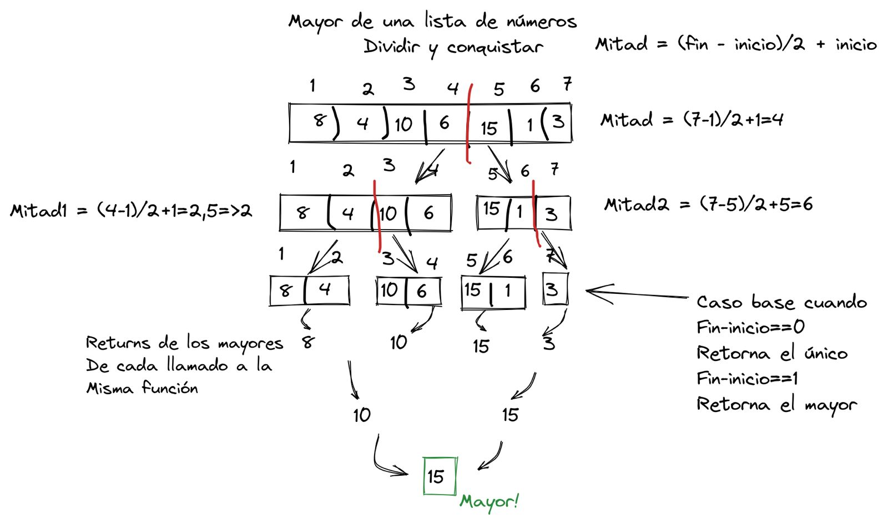

# Ejercicio 10 LPII

Buenas chicos, espero estén bien, les dejo la resolución del algoritmo DyV para encontrar el número más grande de una lista de números.

Lo que debemos hacer es ir dividiendo a la mitad el vector hasta que queden solo 1 o 2 elementos en las ramas (estos serían los casos bases) si queda solo uno entonces devolvemos ese único elemento, si quedan 2 entonces comparamos ambos y devolvemos el mayor, al ir retornando de los casos bases vamos a tener 2 números, el mayor de cada rama (derecha e izquierda), los comparamos y devolvemos el mayor de estos, así sucesivamente hasta que en el primer llamado que hicimos vamos a obtener y devolver el mayor de todo el vector.

En la imagen pueden ver cómo funciona el algoritmo en un vector de tamaño 7.

Espero haberme explicado bien, cualquier cosa no duden en consultarme.

Saludos,

Fran.